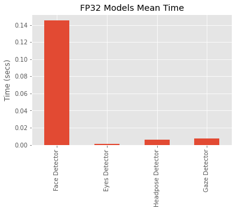
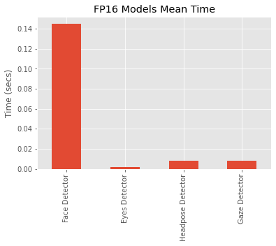

# Computer Pointer Controller

This is the last Project in order to obtain the Intel Edge AI Nanodegree from Udacity, the objective is to create an application capable of moving the computer pointer using only the movement from the head and eyes. This involves many considerations:

* We need several models working together, each one covering a needed functionality. For example, a face detection model is used to feed a face landmarks model.
* We need to control the application logic to create an optimal flow, as the models involved could use a lot of resources.
* Regarding the models themselves, it could be interesting to check if we could use different precisions models in order to gain more performance.

In general, the flow looks like this:

<p align="center">

</p>

## Project Set Up and Installation

### Step 1. Install and configure OpenVINO
It is necessary to have installed OpenVINO, follow the instructions [here](https://docs.openvinotoolkit.org/latest/index.html) depending on your Operating System.

**Note**: This project was created using OpenVINO version 2020.1, it should work in older and newer versions but keep this in mind if you face any issue.

### Step 2. Clone this Repository
Create a new folder and clone this repository. As provided, it should have everything to run the application.

### Step 3. Create and configure a Python Virtual Environment
This is recommended as a good practice. This project assumes you have Python>=3.6.9, if not, please check the related [documentation](https://www.python.org/downloads/).

Having Python installed, create a virtual environment running the following shell command:

```
python3 -m venv <your-env>
```

Activate it by running:

```
source your-env/bin/activate
```

Install required libraries and dependencies provided in requirements.txt:

```
 pip3 install -r requirements.txt
```

### Step 4. Download OpenVINO pretrained models:

This repo already includes the models to use under "intel" folder. But if you want to download and use different ones then you should download them inside "intel" folder. For example running inside gaze-pointer-controller folder:

```
python3 <openvino-installation-path>/deployment_tools/tools/model_downloader/downloader.py --name face-detection-adas-0001 --precisions FP32
```
Will download the model [face-detection-adas-0001](https://docs.openvinotoolkit.org/latest/_models_intel_face_detection_adas_0001_description_face_detection_adas_0001.html) model under the "intel" folder.

**Note**: In Linux, "openvino-installation-path" usually is: /opt/intel/opnevino

For example, the working directory tree for gaze-pointer-controller I used was:

```
├── bin
│   └── demo.mp4
├── intel
│   ├── face-detection-adas-0001
│   │   ├── FP16
│   │   │   ├── face-detection-adas-0001.bin
│   │   │   └── face-detection-adas-0001.xml
│   │   └── FP32
│   │       ├── face-detection-adas-0001.bin
│   │       └── face-detection-adas-0001.xml
│   ├── gaze-estimation-adas-0002
│   │   ├── FP16
│   │   │   ├── gaze-estimation-adas-0002.bin
│   │   │   └── gaze-estimation-adas-0002.xml
│   │   └── FP32
│   │       ├── gaze-estimation-adas-0002.bin
│   │       └── gaze-estimation-adas-0002.xml
│   ├── head-pose-estimation-adas-0001
│   │   ├── FP16
│   │   │   ├── head-pose-estimation-adas-0001.bin
│   │   │   └── head-pose-estimation-adas-0001.xml
│   │   └── FP32
│   │       ├── head-pose-estimation-adas-0001.bin
│   │       └── head-pose-estimation-adas-0001.xml
│   └── landmarks-regression-retail-0009
│       ├── FP16
│       │   ├── landmarks-regression-retail-0009.bin
│       │   └── landmarks-regression-retail-0009.xml
│       └── FP32
│           ├── landmarks-regression-retail-0009.bin
│           └── landmarks-regression-retail-0009.xml
├── README.md
├── requirements.txt
├── resources
│   ├── FP16.png
│   ├── FP32.png
│   └── pipeline.png
├── src
│   ├── input_feeder.py
│   ├── main.py
│   ├── model.py
│   ├── mouse_controller.py
└── utils.py
```

## Demo

A demo could be run using a video file already provided:
```
python3 src/main.py -i bin/demo.mp4
```

Or using a webcamera:
```
python src/main.py -i CAM
```

## Documentation

### Input Flag:
This is the only required flag, this is used to indicate the input file or to state that you want to use the webcamera:

```-i or --input```: Location of the input file. Type 'CAM' to use the webcamera.

### Visualization Flags:

This project uses many different models, as explained at the beginning of this document. Each output could be showed on screen using appropriate command line flags

```-vf or --view_face```: To view a bounding box over the detected face.

```-ve or --view_eyes```: To view bounding boxes surrounding both eyes.

```-vh or --view_headpose```: To view Yaw, Pitch and Roll angles.

```-vg or --view_gaze```: To view estimated gaze direction.


### Models Flags:

To use different models than the default ones, you could use the following flags. However, keep in mind that model output shape could change, potentially crashing the application.

```-mf or --model_facedetector```: To indicate the path to the face detector model .xml file.

```-ml or --model_facelm```: To indicate the path to the face landmarks detector model .xml file.

```-mh or --model_headpose```: To indicate the path to the headpose model .xml file.

```-mg or --model_gaze```: To indicate the path to the gaze detector model .xml file

### Other Flags:

These flags control other behaviours of the code logic: 

```-l or --cpu_extension```: If needed, this flag should be used to provide the path for an OpenVINO cpu extension.

```-d or --device```: To specify the hardware where the models will be running. Default is CPU.

```-pt or --prob_threshold```: To state the confidence the models need to have in order to consider an actual detection.

```-fc or --frame_count```: To state how many frames count before actually doing a detection, useful for debugging and for low resources hardware.


## Benchmarks

**Processor Characteristics:** Intel® Core i5-3230M @2.6 GHz Ivy Bridge (3rd Generation)


#### Mean inference time per precision:

<p align="center">

</p>
<br>
<p align="center">

</p>

#### Models load time (in secs):

|       Model       |   FP32    |  FP16  |
|:-----------------:|:---------:|:------:|
| Face              |  0.3105   | 0.3457 |
| Face Landmarks    |  0.0729   | 0.076  |
| Headpose          |  0.1233   | 0.116  |
| Gaze              |  0.1412   | 0.1586 |


## Results

In this case, both model precisions tested had around the same performance. what is remarkably is that the face detection model is, by far, the most expensive computationally speaking, representing around 50% of all the inference time taken per frame.

In order to improve the application, it is suggested to check if there is another available face detection model that could reach similar performance, because at this point the biggest issue is the time taken for this model.

Regarding accuracy, it wasn't observed big differences between FP32 and FP16 models. This could be relevant because with FP16 models we can use hardware accelerators like VPUs without worrying about accuracy loss.